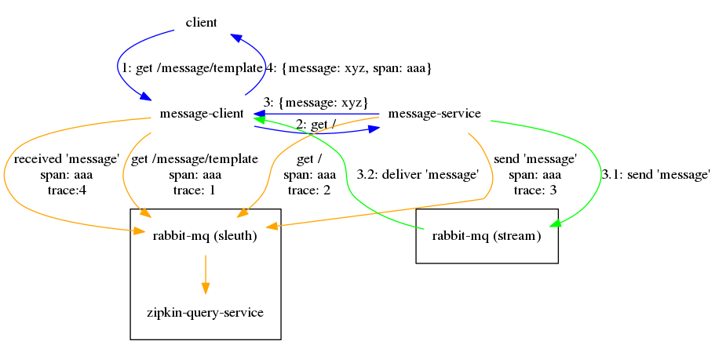

Cet projet permet de valider l'utilisation de Spring Cloud Sleuth sur PCF.

Le code est basé sur [sleuth-blog](https://github.com/joshlong/sleuth-blog/) avec quelques modification afin de simplifier et faire fonctionner l'exemple sur PCF. Veuillez consulter la documentation sur ce lien afin d'en avoir une compréhension plus approfondie.


### Structure du projet
- message-client : application avec service REST pour recevoir des requètes.
- message-service : application avec service REST appelée par `message-client`.
- zipkin-query-service : serveur pour recevoir les messages Sleuth. Il permet aussi la consultation des données via un interface web et une API REST. Les données sont mantenue en mémoire et sont donc perdues lors des arrêts.
- smoketests : ensemble de tests qui fait des requètes afin de valider le bon foncionnement des modules précédents et des traces Sleuth.
- eureka-service : service registry lorsqu'on désire faire des essais hors PCF.

L'appel à `message-client/message/template` crée la trace suivante :



## Déploiement sur PCF
Le fichier `manifest.yml` contient la configuration pour le déploiement sur PCF.

Le préfix `sleuth-` est ajouté au nom de chaque module pour définir le nom des applications.

Le pipeline pour lancer le déploiement sur PCF se trouve dans `ci/pipeline.yml`.

### Services pré-requis
- `service-registry` : Un service registry qui sera lié aux applications `sleuth-message-client` et `sleuth-message-service`.
- `sleuth-rabbitmq` : Un service de Rabbit MQ pour permettre le passage de messages entre `sleuth-message-client`, `sleuth-message-service` et `sleuth-zipkin-query-service`

### Pivotal Web Services (PWS)

#### Services
| name | service | plan | bound apps |
| - | - | - | - |
| service-registry | p-service-registry | standard | sleuth-message-client, sleuth-message-service |
| sleuth-rabbitmq | cloudamqp | lemur | sleuth-message-client, sleuth-message-service, sleuth-zipkin-query-service |

Pour créer ces services :

```
cf create-service p-service-registry standard service-registry
cf create-service cloudamqp lemur sleuth-rabbitmq
```
